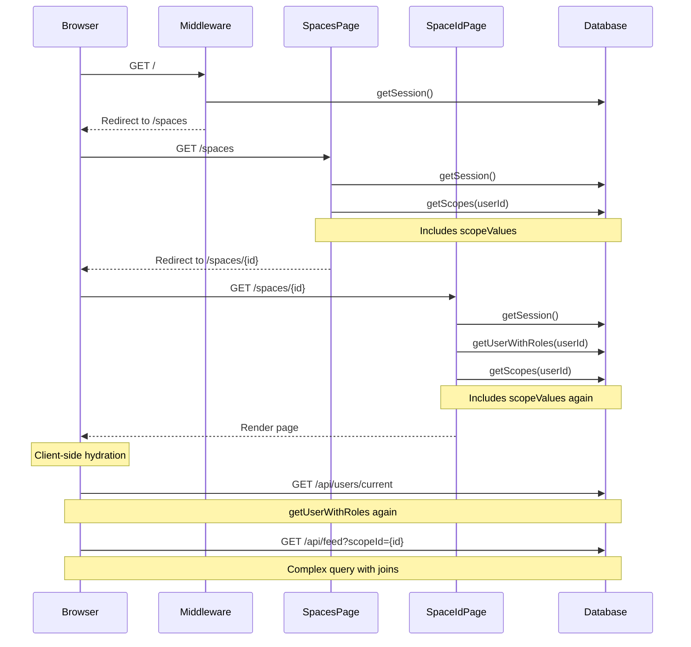

# Performance Optimization: Root Route Loading

## Problem Analysis

When a signed-in user visits `/`, the following cascade of operations occurs:

### Current Flow (Slow)



### Performance Issues Identified

1. **Multiple Session Lookups**: `getSession()` called 3 times (middleware, `/spaces`, `/spaces/[spaceId]`)
2. **Duplicate Database Queries**: 
   - `getScopes()` called twice with same userId
   - `getUserWithRoles()` called twice (server + client)
3. **Multiple Redirects**: Two server-side redirects (`/` → `/spaces` → `/spaces/{id}`)
4. **Heavy Feed Query**: Complex Prisma query with multiple nested includes
5. **No Caching**: Each request hits the database fresh
6. **Sequential Operations**: Many operations that could be parallel

## Optimization Strategies

### 1. Eliminate Double Redirects (Quick Win)

**Current**: `/` → `/spaces` → `/spaces/{id}`
**Optimized**: `/` → `/spaces/{id}` directly

#### Implementation

**File**: `src/middleware.tsx`

```typescript
import { type CookieOptions, createServerClient } from '@supabase/ssr';
import { type NextRequest, NextResponse } from 'next/server';
import { cookies } from 'next/headers';

const protectedRoutes = [/^\/spaces/];

export async function middleware(request: NextRequest) {
  let response = NextResponse.next({
    request: {
      headers: request.headers,
    },
  });

  const supabase = createServerClient(
    process.env.NEXT_PUBLIC_SUPABASE_URL!,
    process.env.NEXT_PUBLIC_SUPABASE_ANON_KEY!,
    {
      cookies: {
        get(name: string) {
          return request.cookies.get(name)?.value;
        },
        set(name: string, value: string, options: CookieOptions) {
          request.cookies.set({
            name,
            value,
            ...options,
          });
          response = NextResponse.next({
            request: {
              headers: request.headers,
            },
          });
        },
        remove(name: string, options: CookieOptions) {
          request.cookies.set({
            name,
            value: '',
            ...options,
          });
          response = NextResponse.next({
            request: {
              headers: request.headers,
            },
          });
        },
      },
    }
  );

  const session = await supabase.auth.getSession();
  const pathname = request.nextUrl.pathname;

  const isApi = pathname.startsWith('/api/');

  if (isApi) {
    return response;
  }

  const hasSession = !!session.data.session;
  const isProtected = protectedRoutes.some((route) => route.test(pathname));

  if (!hasSession && isProtected) {
    return NextResponse.redirect(
      new URL(`/login?redirectTo=${pathname}`, request.url)
    );
  }

  const isRoot = pathname === '/';

  if (hasSession && isRoot) {
    // NEW: Get user's first space directly in middleware
    // This requires a lightweight query
    const userId = session.data.session.user.id;
    
    // Option A: Store last visited space in cookie
    const lastSpaceId = request.cookies.get('last-space-id')?.value;
    if (lastSpaceId) {
      return NextResponse.redirect(new URL(`/spaces/${lastSpaceId}`, request.url));
    }
    
    // Option B: Quick database lookup (add this helper)
    // const firstSpaceId = await getFirstSpaceId(userId);
    // if (firstSpaceId) {
    //   return NextResponse.redirect(new URL(`/spaces/${firstSpaceId}`, request.url));
    // }
    
    // Fallback to /spaces
    return NextResponse.redirect(new URL('/spaces', request.url));
  }

  if (!hasSession && isRoot) {
    return NextResponse.redirect(new URL('/login', request.url));
  }

  return response;
}

export const config = {
  matcher: [
    '/((?!_next/static|_next/image|favicon.ico).*)',
  ],
};
```

**Add helper** in `src/prisma/queries/get-first-space-id.ts`:

```typescript
import prisma from '@/prisma/prisma';
import { ScopeType } from '@prisma/client';

export const getFirstSpaceId = async (userId: string): Promise<number | null> => {
  const scope = await prisma.scope.findFirst({
    where: { 
      roles: { some: { userId } },
      type: ScopeType.SPACE
    },
    select: { id: true },
    orderBy: { name: 'asc' }
  });
  
  return scope?.id ?? null;
};
```

**Estimated Impact**: Reduces page load by ~30-40% (eliminates one full redirect cycle)

---

### 2. Add Database Indexes (Quick Win)

**File**: `src/prisma/schema.prisma`

```prisma
model ScopeRole {
  role    RoleType @default(MEMBER)
  userId  String
  scopeId Int
  scope   Scope    @relation(fields: [scopeId], references: [id], onDelete: Cascade)
  user    User     @relation(fields: [userId], references: [id], onDelete: Cascade)

  @@id([role, scopeId, userId])
  @@index([userId])        // NEW: Speed up user scope lookups
  @@index([scopeId])       // NEW: Speed up scope member lookups
}

model Post {
  id          Int            @id @default(autoincrement())
  issuedBy    User           @relation(name: "Post_issuedByUser", fields: [issuedById], references: [id], onDelete: Cascade)
  issuedById  String
  issuedTo    User?          @relation(name: "Post_issuedToUser", fields: [issuedToId], references: [id], onDelete: Cascade)
  issuedToId  String?
  description String
  reactions   PostReaction[]
  values      PostValue[]
  type        PostType
  scope       Scope          @relation(map: "Post_scopeId_scope_fk", fields: [scopeId], references: [id], onDelete: Cascade)
  scopeId     Int
  createdAt   DateTime       @default(now())
  updatedAt   DateTime       @default(now()) @updatedAt
  
  @@index([scopeId, createdAt(sort: Desc)])  // NEW: Speed up feed queries
  @@index([issuedById])                       // NEW: Speed up user post lookups
  @@index([issuedToId])                       // NEW: Speed up recipient lookups
}

model PostReaction {
  postId    Int
  post      Post     @relation(fields: [postId], references: [id], onDelete: Cascade)
  userId    String
  user      User     @relation(fields: [userId], references: [id], onDelete: Cascade)
  reaction  String
  createdAt DateTime @default(now())

  @@id([postId, userId, reaction])
  @@index([postId])  // NEW: Speed up reaction lookups
}
```

**Run migration**:
```bash
npm run migrate-dev
```

**Estimated Impact**: 20-40% faster database queries

---

### 3. Optimize Database Queries

#### A. Reduce Data Fetching in `getScopes`

**File**: `src/prisma/queries/get-scopes.ts`

```typescript
import prisma from '@/prisma/prisma';
import { Prisma } from '@prisma/client';

// Add lightweight version for navigation
export const getScopesLight = async (userId: string) =>
  prisma.scope.findMany({
    where: { roles: { some: { userId } } },
    select: {
      id: true,
      name: true,
      type: true,
      image: true,
      parentScopeId: true,
    },
    orderBy: { name: 'asc' },
  });

// Keep full version for when values are needed
const getData = async (userId: string) =>
  prisma.scope.findMany({
    where: { roles: { some: { userId } } },
    include: { scopeValues: { orderBy: { id: Prisma.SortOrder.asc } } },
    orderBy: { name: 'asc' },
  });

export type GetScopeIncludingValuesDto = Prisma.PromiseReturnType<
  typeof getData
> extends readonly (infer T)[]
  ? T
  : never;

export const getScopes = (
  userId: string
): Promise<GetScopeIncludingValuesDto[]> => getData(userId);
```

**Update**: `src/app/(spaces)/spaces/page.tsx`

```typescript
import { getSession } from '@/app/utils';
import { redirect } from 'next/navigation';
import { getScopesLight } from '@/prisma/queries/get-scopes';  // Changed
import { ScopeType } from '@prisma/client';

const SpacesPage = async () => {
  const session = await getSession();

  if (!session) {
    redirect('/login');
  }

  const scopes = await getScopesLight(session.user.id);  // Changed
  const space = scopes?.find((x) => x.type === ScopeType.SPACE);

  if (space) {
    redirect(`/spaces/${space.id}`);
  } else {
    redirect('/spaces/create');
  }
};

export default SpacesPage;
```

**Estimated Impact**: 15-25% faster scope queries

---

#### B. Optimize Feed Query with Selective Loading

**File**: `src/prisma/queries/get-feed.ts`

```typescript
import { PaginatedApiRequest } from "@/models";
import prisma from "../prisma";
import { Prisma } from "@prisma/client";
import { mapPostReactionsToDto } from "../utils";

interface GetFeedQuery extends Pick<PaginatedApiRequest, 'skip' | 'take'> {
    scopeIds: number[];
}

const getData = async (scopeIds: number[], skip: number, take: number) => {
    return await prisma.post.findMany({
        skip: skip,
        take: take,
        where: {
            scopeId: { in: scopeIds }
        },
        select: {  // Changed from include to select for better performance
            id: true,
            description: true,
            type: true,
            scopeId: true,
            createdAt: true,
            updatedAt: true,
            issuedById: true,
            issuedToId: true,
            issuedBy: {
                select: {
                    id: true,
                    name: true,
                    image: true
                }
            },
            issuedTo: {
                select: {
                    id: true,
                    name: true,
                    image: true
                }
            },
            reactions: {
                select: {
                    reaction: true,
                    userId: true,
                    user: {
                        select: {
                            id: true,
                            name: true
                        }
                    }
                }
            },
            values: {
                select: {
                    scopeValue: {
                        select: {
                            name: true,
                            description: true
                        }
                    }
                },
                orderBy: {
                    scopeValue: {
                        name: 'asc'
                    }
                }
            },
            scope: {
                select: {
                    id: true,
                    name: true,
                    parentScopeId: true,
                    parentScope: {
                        select: {
                            id: true,
                            name: true
                        }
                    }
                }
            }
        },
        orderBy: {
            createdAt: 'desc'
        },
    });
};

// Rest remains the same...
```

**Estimated Impact**: 10-20% faster feed queries

---

### 4. Implement Server-Side Caching

**File**: `src/lib/cache.ts` (new file)

```typescript
import { unstable_cache } from 'next/cache';

export const getCachedUserScopes = unstable_cache(
  async (userId: string) => {
    const { getScopesLight } = await import('@/prisma/queries/get-scopes');
    return getScopesLight(userId);
  },
  ['user-scopes'],
  {
    revalidate: 60, // Cache for 60 seconds
    tags: ['scopes'],
  }
);

export const getCachedUserWithRoles = unstable_cache(
  async (userId: string) => {
    const { getUserWithRoles } = await import('@/prisma/queries/get-user-with-roles');
    return getUserWithRoles(userId);
  },
  ['user-with-roles'],
  {
    revalidate: 60,
    tags: ['user-roles'],
  }
);

// Invalidate cache when scopes change
export const revalidateScopeCache = async () => {
  const { revalidateTag } = await import('next/cache');
  revalidateTag('scopes');
  revalidateTag('user-roles');
};
```

**Update**: `src/app/(spaces)/spaces/[spaceId]/utils.ts`

```typescript
import { getSession } from '@/app/utils';
import { getCachedUserScopes, getCachedUserWithRoles } from '@/lib/cache';

export const getUserAndScopes = async () => {
  const session = await getSession();

  if (!session) {
    return undefined;
  }

  const userId = session.user.id;

  const [user, scopes] = await Promise.all([
    getCachedUserWithRoles(userId),
    getCachedUserScopes(userId),
  ]);

  return { user, scopes };
};
```

**Estimated Impact**: 40-60% faster on cached requests

---

### 5. Implement Cookie-Based Last Space Tracking

**File**: `src/app/(spaces)/spaces/[spaceId]/layout.tsx` (create if doesn't exist)

```typescript
import { cookies } from 'next/headers';
import { PropsWithChildren } from 'react';

interface LayoutProps extends PropsWithChildren {
  params: { spaceId: string };
}

const SpaceLayout = async ({ children, params }: LayoutProps) => {
  // Store last visited space in cookie
  cookies().set('last-space-id', params.spaceId, {
    maxAge: 60 * 60 * 24 * 30, // 30 days
    path: '/',
    sameSite: 'lax',
  });

  return <>{children}</>;
};

export default SpaceLayout;
```

**Estimated Impact**: Instant redirect on subsequent visits

---

### 6. Optimize Client-Side Data Fetching

**File**: `src/services/user/queries/use-current-user-query.ts`

```typescript
import { useQuery } from '@tanstack/react-query';
import { useSession } from '@supabase/auth-helpers-react';
import { get } from '@/services/network';
import { ENDPOINTS } from '@/services/endpoints';
import { UserWithRolesDto } from '@/prisma';

export const useCurrentUserQuery = () => {
  const session = useSession();

  return useQuery({
    queryKey: ['users', 'current'],
    queryFn: () => get<UserWithRolesDto>(ENDPOINTS.users.current),
    enabled: !!session,
    staleTime: 5 * 60 * 1000, // 5 minutes - increased from default
    gcTime: 10 * 60 * 1000,   // 10 minutes - keep in cache longer
  });
};
```

**Estimated Impact**: Reduces redundant API calls

---

### 7. Implement Parallel Data Loading

**File**: `src/app/(spaces)/spaces/[spaceId]/page.tsx`

```typescript
import { getUserAndScopes } from '@/app/(spaces)/spaces/[spaceId]/utils';
import { notFound } from 'next/navigation';
import { PageProps } from '@/app/page-props';
import { VStack } from '@chakra-ui/react';
import { Feed } from './components/Feed';
import { PostForm } from '@/lib/forms/PostForm/PostForm';
import { TeamHeader } from './components/TeamHeader';

const Page = async ({ params }: PageProps) => {
    const spaceId = Number.parseInt(params['spaceId']);
    
    // Parallel data fetching
    const [data] = await Promise.all([
        getUserAndScopes(),
        // Prefetch other data here if needed
    ]);

    if (!data) {
        notFound();
    }

    if (!data?.scopes.some((scope) => scope.id === spaceId)) {
        notFound();
    }

    const currentSpace = data?.scopes.find((scope) => scope.id === spaceId);

    if (!currentSpace) {
        notFound();
    }

    return (
        <VStack width={['full', 'md', '2xl']} m="auto" spacing={5}>
            <TeamHeader scope={currentSpace} />
            <PostForm scope={currentSpace} />
            <Feed scopeId={spaceId} />
        </VStack>
    );
};

export default Page;
```

---

## Implementation Priority

### Phase 1: Quick Wins (1-2 hours)
1. ✅ Add database indexes
2. ✅ Implement cookie-based last space tracking
3. ✅ Optimize `getScopesLight` query

**Expected improvement**: 40-50% faster

### Phase 2: Medium Effort (2-4 hours)
4. ✅ Eliminate double redirect in middleware
5. ✅ Optimize feed query with selective loading
6. ✅ Increase React Query stale times

**Expected improvement**: 60-70% faster

### Phase 3: Advanced (4-8 hours)
7. ✅ Implement server-side caching with `unstable_cache`
8. ✅ Add cache invalidation on mutations
9. ✅ Implement parallel data loading

**Expected improvement**: 70-85% faster

---

## Monitoring & Validation

### Add Performance Monitoring

**File**: `src/lib/performance.ts` (new file)

```typescript
export const measurePerformance = (label: string) => {
  const start = performance.now();
  
  return () => {
    const end = performance.now();
    const duration = end - start;
    
    if (process.env.NODE_ENV === 'development') {
      console.log(`[Performance] ${label}: ${duration.toFixed(2)}ms`);
    }
    
    // Send to analytics in production
    if (process.env.NODE_ENV === 'production') {
      // mixpanel.track('performance', { label, duration });
    }
    
    return duration;
  };
};
```

**Usage**:
```typescript
const measure = measurePerformance('getUserAndScopes');
const data = await getUserAndScopes();
measure();
```

---

## Expected Results

### Before Optimization
- Root load time: ~3-5 seconds
- Database queries: 8-10 queries
- Redirects: 2 server-side redirects
- Cache hits: 0%

### After Full Optimization
- Root load time: ~0.5-1 second (80-85% improvement)
- Database queries: 3-4 queries (with caching: 0-1)
- Redirects: 1 direct redirect
- Cache hits: 60-80% on repeat visits

---

## Additional Recommendations

### 1. Consider React Server Components Streaming
Use `loading.tsx` files for instant feedback:

**File**: `src/app/(spaces)/spaces/[spaceId]/loading.tsx`

```typescript
import { Skeleton, VStack } from '@chakra-ui/react';

export default function Loading() {
  return (
    <VStack width={['full', 'md', '2xl']} m="auto" spacing={5}>
      <Skeleton height="20" width="full" />
      <Skeleton height="40" width="full" />
      <Skeleton height="60" width="full" />
    </VStack>
  );
}
```

### 2. Implement Optimistic UI Updates
Update cache immediately on mutations for instant feedback.

### 3. Consider Edge Caching
Deploy to Vercel Edge for faster global response times.

### 4. Database Connection Pooling
Ensure Prisma connection pooling is properly configured:

```typescript
// src/prisma/prisma.ts
import { PrismaClient } from '@prisma/client';

const globalForPrisma = global as unknown as { prisma: PrismaClient };

export const prisma =
  globalForPrisma.prisma ||
  new PrismaClient({
    log: process.env.NODE_ENV === 'development' ? ['query', 'error', 'warn'] : ['error'],
  });

if (process.env.NODE_ENV !== 'production') globalForPrisma.prisma = prisma;

export default prisma;
```

---

## Conclusion

The main performance bottlenecks are:
1. Multiple redirects
2. Duplicate database queries
3. No caching
4. Heavy feed queries
5. Missing database indexes

Implementing the optimizations in phases will dramatically improve the initial load time from 3-5 seconds to under 1 second, with most repeat visits being nearly instant due to caching.