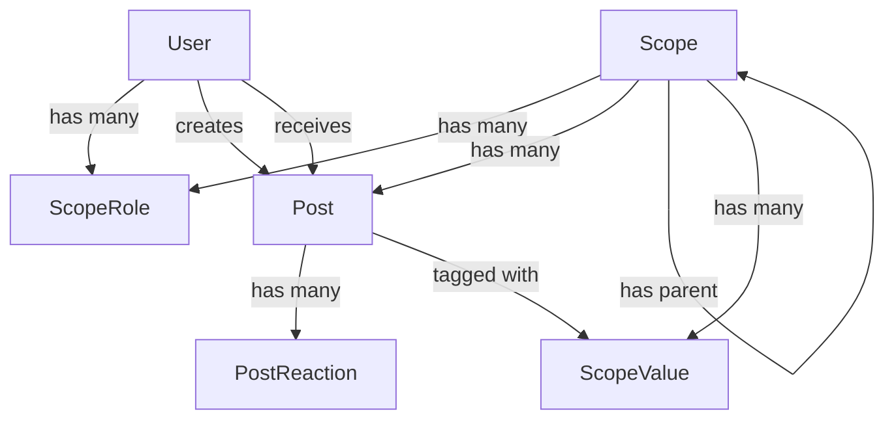

# Teamtjie Project Context

## Project Overview

**Teamtjie** is a collaborative team management and recognition platform built with Next.js 14, focusing on organizational spaces, teams, and celebrating wins. The application enables hierarchical team structures with role-based access control and social features like posts, reactions, and notifications.

## Technology Stack

### Core Framework
- **Next.js 14.2.5** - React framework with App Router
- **React 18.2.0** - UI library
- **TypeScript 5.3.3** - Type-safe development

### Backend & Database
- **Prisma 5.18.0** - ORM for PostgreSQL
- **PostgreSQL** - Primary database
- **Supabase** - Authentication and database hosting
- **next-api-decorators 2.0.2** - Decorator-based API routes

### Frontend UI
- **Chakra UI 2.8.2** - Component library
- **Framer Motion 10.0.1** - Animations
- **React Hook Form 7.43.5** - Form management
- **Downshift 7.6.0** - Autocomplete components

### State Management & Data Fetching
- **TanStack Query 5.17.0** (React Query) - Server state management
- **Immer 9.0.19** - Immutable state updates

### Authorization
- **CASL 6.5.0** - Ability-based access control
- **Custom middleware** - Role-based permissions

### Notifications & Email
- **SendGrid** - Email service
- **Resend 4.0.0** - Email API
- **Mixpanel** - Analytics tracking

### Development Tools
- **Barrelsby 2.5.1** - Automatic barrel file generation
- **Prettier 3.1.1** - Code formatting
- **ESLint** - Code linting
- **Playwright** - E2E testing
- **Jest** - Unit testing

## Project Structure

```
teamtjie/
├── src/
│   ├── app/                      # Next.js App Router pages
│   │   ├── (auth)/              # Authentication routes
│   │   ├── (spaces)/            # Space management routes
│   │   ├── (settings)/          # Settings routes
│   │   ├── (me)/                # User profile routes
│   │   ├── (insights)/          # Analytics routes
│   │   ├── (marketing)/         # Marketing pages
│   │   └── playground/          # Component playground
│   ├── pages/api/               # API routes (Pages Router)
│   │   ├── admin/               # Admin endpoints
│   │   ├── avatars/             # Avatar management
│   │   ├── feed/                # Post feed endpoints
│   │   ├── insights/            # Analytics endpoints
│   │   ├── invitations/         # Invitation management
│   │   ├── permissions/         # Permission queries
│   │   ├── scopes/              # Scope (Space/Team) CRUD
│   │   └── users/               # User management
│   ├── backend/                 # Backend utilities
│   │   ├── middleware/          # Custom middleware
│   │   │   ├── authorize/       # Authentication middleware
│   │   │   ├── with-abilities/  # Authorization middleware
│   │   │   ├── paginated/       # Pagination middleware
│   │   │   └── roles/           # Role checking middleware
│   │   └── notifications/       # Notification services
│   ├── prisma/                  # Database layer
│   │   ├── schema.prisma        # Database schema
│   │   ├── commands/            # Write operations
│   │   ├── queries/             # Read operations
│   │   └── utils/               # Database utilities
│   ├── lib/                     # Reusable components
│   │   ├── buttons/             # Button components
│   │   ├── cards/               # Card components
│   │   ├── forms/               # Form components
│   │   ├── inputs/              # Input components
│   │   ├── modals/              # Modal dialogs
│   │   ├── tags/                # Tag/badge components
│   │   ├── hooks/               # Custom React hooks
│   │   └── templates/           # Page templates
│   ├── services/                # API client layer
│   │   ├── avatar/              # Avatar mutations
│   │   ├── feed/                # Feed queries/mutations
│   │   ├── invitation/          # Invitation operations
│   │   ├── insights/            # Analytics queries
│   │   ├── permissions/         # Permission queries
│   │   ├── scope/               # Scope operations
│   │   └── user/                # User operations
│   ├── models/                  # TypeScript types
│   │   ├── dtos/                # Data Transfer Objects
│   │   └── types/               # Type definitions
│   ├── permissions/             # Authorization logic
│   │   ├── abilities.ts         # CASL ability definitions
│   │   ├── permissions.ts       # Permission helpers
│   │   └── roles.ts             # Role utilities
│   ├── theme/                   # Chakra UI theming
│   │   ├── components/          # Component styles
│   │   ├── marketing/           # Marketing theme
│   │   └── styles/              # Global styles
│   ├── utils/                   # Utility functions
│   └── middleware.tsx           # Next.js middleware
├── public/                      # Static assets
└── package.json
```

## Core Concepts

### 1. Scopes (Spaces & Teams)

The application uses a hierarchical "Scope" system:

- **Space**: Top-level organizational unit (e.g., a company or department)
- **Team**: Child unit within a Space (e.g., a project team)

```typescript
enum ScopeType {
  SPACE
  TEAM
}
```

**Key Features:**
- Hierarchical structure (Teams belong to Spaces)
- Role-based access (ADMIN, MEMBER, GUEST)
- Custom values (company values/principles)
- Links (resources, documentation)
- Post permissions (configurable by role)

### 2. Role-Based Access Control (RBAC)

Three role types with different permissions:

```typescript
enum RoleType {
  ADMIN   // Full control, can edit settings, manage members
  MEMBER  // Can read, post, invite members/guests
  GUEST   // Limited access, can read (teams only)
}
```

**Permission Model:**
- **Access**: View scope name and logo
- **Read**: View members, posts, teams, reactions
- **Invite**: Add new members (role-dependent)
- **Edit**: Modify settings, charter, members (admin only)
- **Post**: Create posts (configurable per scope)

### 3. Posts & Feed

Currently supports **WIN** posts for celebrating achievements:

```typescript
enum PostType {
  WIN
}
```

**Post Features:**
- Description with negative language detection
- Issued by/to users
- Tagged with scope values
- Reactions (emoji-based)
- Scope-level visibility controls
- Email notifications

### 4. Authentication & Authorization

**Authentication:**
- Supabase Auth (OAuth providers: Google, Microsoft)
- OTP-based login
- Session management via cookies
- JWT token validation

**Authorization:**
- CASL-based ability checks
- Middleware decorators (`@Authorize`, `@WithAbilities`)
- Subject-based permissions
- Dynamic permission evaluation

### 5. Notifications

**Channels:**
- Email (SendGrid/Resend)
- In-app (future)

**Events:**
- New win posted (to scope members)
- Win received (to individual user)
- User preferences per event type

## Database Schema

### Core Models

**User**
- Authentication identity
- Profile information (name, email, image, aboutMe)
- Roles in multiple scopes
- Posts issued/received
- Reactions
- Notification preferences

**Scope**
- Hierarchical structure (parent/child)
- Type (SPACE/TEAM)
- Profile (name, image, description)
- Public/private visibility
- Values, links, roles, posts

**ScopeRole**
- User-Scope-Role relationship
- Composite primary key
- Cascade deletion

**Post**
- Type (WIN)
- Description
- Issued by/to users
- Scope association
- Values (tags)
- Reactions

**Invitation**
- Hash-based links
- Expiration
- Default role
- Acceptance tracking

### Key Relationships



## API Architecture

### API Route Pattern

Using `next-api-decorators` for clean, decorator-based API routes:

```typescript
@Catch(defaultExceptionHandler)
class Handler {
  @Get()
  @Authorize()
  @WithAbilities()
  public async method(@Req() req: AbilitiesApiRequest) {
    // Implementation
  }
}
```

### Middleware Stack

1. **@Authorize()** - Validates Supabase session, extracts userId
2. **@WithAbilities()** - Loads user roles and permissions
3. **@Paginated()** - Adds pagination parameters (skip, take)
4. **@Catch()** - Error handling wrapper

### API Endpoints

**Scopes** (`/api/scopes`)
- `GET /` - List user's scopes
- `POST /` - Create scope
- `GET /:id` - Get scope profile
- `PUT /:id` - Update scope
- `DELETE /:id` - Delete scope
- `GET /:id/children` - List child scopes
- `GET /:id/values` - List scope values
- `PUT /:id/values` - Create/update value
- `DELETE /:id/values/:valueId` - Delete value
- `GET /:id/links` - List scope links
- `POST /:id/links` - Create link
- `PUT /:id/links/:linkId` - Update link
- `DELETE /:id/links/:linkId` - Delete link
- `PUT /:id/roles` - Update member role
- `PUT /:id/roles/remove` - Remove member
- `DELETE /:id/leave` - Leave scope
- `GET /:id/permissions` - Get post permissions
- `POST /:id/permissions/roles` - Add permission role
- `PUT /:id/permissions/roles` - Remove permission role

**Feed** (`/api/feed`)
- `GET /` - Get paginated feed
- `POST /` - Create post
- `POST /validate` - Validate post content
- `POST /:id/reactions` - Add reaction
- `DELETE /:id/reactions/:emoji` - Remove reaction

**Users** (`/api/users`)
- `GET /` - List users (filtered by scope)
- `GET /current` - Get current user
- `PUT /current` - Update current user
- `PUT /email` - Update email
- `GET /:id` - Get user by ID
- `GET /:id/roles/:scopeId` - Get user's role in scope
- `GET /:id/notifications/preferences` - Get notification preferences
- `PUT /:id/notifications/preferences` - Update preferences
- `DELETE /` - Delete account

**Invitations** (`/api/invitations`)
- Create and accept invitations

**Avatars** (`/api/avatars`)
- Upload and manage avatars

**Insights** (`/api/insights`)
- Analytics and usage data

**Permissions** (`/api/permissions`)
- Query user abilities

## Frontend Architecture

### App Router Structure

Using Next.js 14 App Router with route groups:

- `(auth)` - Login, authentication callback
- `(spaces)` - Main application (spaces, teams, feed)
- `(settings)` - Scope settings pages
- `(me)` - User profile and settings
- `(insights)` - Analytics dashboards
- `(marketing)` - Public marketing pages

### State Management

**Server State (React Query)**
- API data fetching and caching
- Optimistic updates
- Automatic refetching
- Pagination support

**Client State**
- React hooks (useState, useReducer)
- Context providers (Ability, Analytics, Dialog)

### Key Hooks

**useSpaceNavigation**
- Manages space/team navigation
- Extracts IDs from URL params
- Provides navigation helpers

**useScope**
- Returns current scope context
- Combines space/team information

**useUserSearch**
- Debounced user search
- Scope-filtered results

**useModal**
- Modal state management
- Disclosure controls

### Component Library

**Forms**
- `CreateScopeForm` - New space/team creation
- `PostForm` - Create posts
- `LoginForm` - Authentication
- `EditScopeProfileForm` - Update scope details

**Cards**
- `PostCard` - Display posts with reactions
- `ScopeMembersCard` - Member list
- `EmptyStateCard` - Empty states

**Modals**
- `PostModal` - Create/edit posts
- `AuthenticationModal` - Login flow
- `EditScopeProfileModal` - Edit scope
- `UpdateAvatarModal` - Avatar cropping
- `ConfirmationModal` - Confirm actions

**Inputs**
- `AutoComplete` - Generic autocomplete
- `UserAutoComplete` - User search
- `ScopeValueAutoComplete` - Value selection
- `AvatarInput` - Image upload

## Key Features

### 1. Hierarchical Organization
- Spaces contain teams
- Inherited permissions
- Cascading visibility

### 2. Flexible Permissions
- Role-based access control
- Per-scope post permissions
- Configurable by post type and action

### 3. Social Features
- Post feed with filtering
- Emoji reactions
- @mentions (via user selection)
- Value tagging

### 4. Notifications
- Email notifications
- User preferences per event
- Scope-level email configuration (Resend API)

### 5. Analytics
- Post usage insights
- App usage tracking
- Mixpanel integration

### 6. Content Moderation
- Negative language detection
- Badwords filtering
- Post validation

## Development Patterns

### 1. Service Layer Pattern

```typescript
// Query
export const useScopeQuery = (id: number) => {
  return useQuery({
    queryKey: ['scope', id],
    queryFn: () => get(`/api/scopes/${id}`)
  });
};

// Mutation
export const useUpdateScopeMutation = () => {
  const queryClient = useQueryClient();
  return useMutation({
    mutationFn: (payload) => put(`/api/scopes/${payload.id}`, payload),
    onSuccess: () => {
      queryClient.invalidateQueries(['scopes']);
    }
  });
};
```

### 2. Command/Query Separation

**Commands** (Write operations in `prisma/commands/`)
```typescript
export const createScope = async (command: CreateScopeCommand) => {
  return await prisma.scope.create({ data: command });
};
```

**Queries** (Read operations in `prisma/queries/`)
```typescript
export const getScope = (id: number): Promise<GetScopeDto> => {
  return prisma.scope.findUnique({ where: { id } });
};
```

### 3. Middleware Composition

```typescript
@Get('/:id')
@Authorize()           // 1. Authenticate
@WithAbilities()       // 2. Load permissions
public async getById(
  @Param('id', ParseNumberPipe) id: number,
  @Req() req: AbilitiesApiRequest
) {
  // 3. Check permissions
  if (!req.abilities.can('read', subject('Scope', { id }))) {
    throw new UnauthorizedException();
  }
  // 4. Execute
  return await getScopeProfile(id);
}
```

### 4. Type Safety

- DTOs with class-validator decorators
- Prisma-generated types
- Custom type guards
- Strict TypeScript configuration

## Environment Variables

```bash
# Supabase
NEXT_PUBLIC_SUPABASE_URL=
NEXT_PUBLIC_SUPABASE_ANON_KEY=
SUPABASE_SERVICE_ROLE_KEY=

# Database
DATABASE_URL=
DIRECT_URL=

# Email
SENDMAIL_ENABLED=
NEXT_PUBLIC_SUPPORT_RECIPIENT=

# Application
NEXT_PUBLIC_BASE_URL=
NODE_ENV=
```

## Common Workflows

### Creating a New Space

1. User clicks "Create Space"
2. `CreateScopeForm` renders
3. User fills name, description, uploads image
4. Form submits to `POST /api/scopes`
5. Backend creates scope with user as ADMIN
6. Frontend redirects to new space
7. Default permissions created

### Posting a Win

1. User clicks "Post Win" in feed
2. `PostModal` opens with `PostForm`
3. User selects recipient, adds description, tags values
4. Content validated for negative language
5. Form submits to `POST /api/feed`
6. Backend creates post
7. Notifications sent (email to scope/user)
8. Feed refreshes with new post

### Inviting Members

1. Admin opens scope settings
2. Clicks "Invite Members"
3. Selects role (ADMIN/MEMBER/GUEST)
4. Backend generates invitation hash
5. Invitation link shared
6. Recipient clicks link
7. Authenticated user accepts invitation
8. Role assigned, access granted

## Testing

### Unit Tests (Jest)
- Component testing
- Utility function testing
- Hook testing

### E2E Tests (Playwright)
- User flows
- Authentication
- CRUD operations

## Build & Deployment

### Build Process
```bash
npm run barrel      # Generate barrel files
npm run build       # Next.js build
```

### Database Migrations
```bash
npm run migrate-dev # Create migration
npm run generate-prisma # Generate Prisma client
```

### Development
```bash
npm run dev         # Start dev server
npm run lint        # Lint code
npm run format      # Format code
```

## Security Considerations

1. **Authentication**: Supabase JWT validation
2. **Authorization**: CASL ability checks on every request
3. **Input Validation**: class-validator DTOs
4. **SQL Injection**: Prisma parameterized queries
5. **XSS**: React automatic escaping
6. **CSRF**: SameSite cookies
7. **Content Moderation**: Negative language detection

## Performance Optimizations

1. **React Query Caching**: 60s stale time
2. **Pagination**: All list endpoints paginated
3. **Optimistic Updates**: Immediate UI feedback
4. **Image Optimization**: Next.js Image component
5. **Code Splitting**: Automatic with App Router
6. **Database Indexes**: On foreign keys and queries

## Future Considerations

Based on the codebase structure:

1. **Additional Post Types**: Schema supports extensibility
2. **In-App Notifications**: Infrastructure partially in place
3. **Real-time Updates**: Could integrate Supabase Realtime
4. **File Attachments**: Avatar system could extend to files
5. **Advanced Analytics**: Insights service expandable
6. **Mobile App**: API-first design supports mobile clients

## Key Files Reference

- **Authentication**: `src/middleware.tsx`, `src/app/utils.ts`
- **Authorization**: `src/permissions/abilities.ts`, `src/backend/middleware/with-abilities/`
- **Database Schema**: `src/prisma/schema.prisma`
- **API Routes**: `src/pages/api/*/[[...slug]].ts`
- **Theme**: `src/theme/theme.ts`, `src/theme/components/`
- **Hooks**: `src/lib/hooks/`, `src/services/*/queries/`, `src/services/*/mutations/`

## Naming Conventions

- **Components**: PascalCase (e.g., `PostCard`)
- **Hooks**: camelCase with `use` prefix (e.g., `useSpaceNavigation`)
- **API Routes**: kebab-case (e.g., `scope-values`)
- **Database**: PascalCase models, camelCase fields
- **Files**: PascalCase for components, kebab-case for utilities

---

**Last Updated**: 2025-12-08
**Version**: 0.1.0