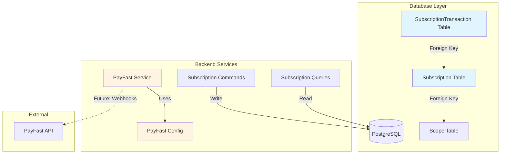
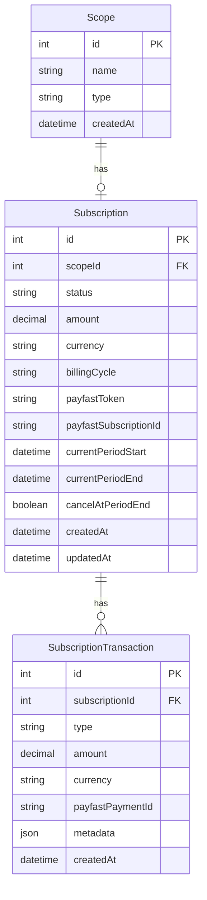
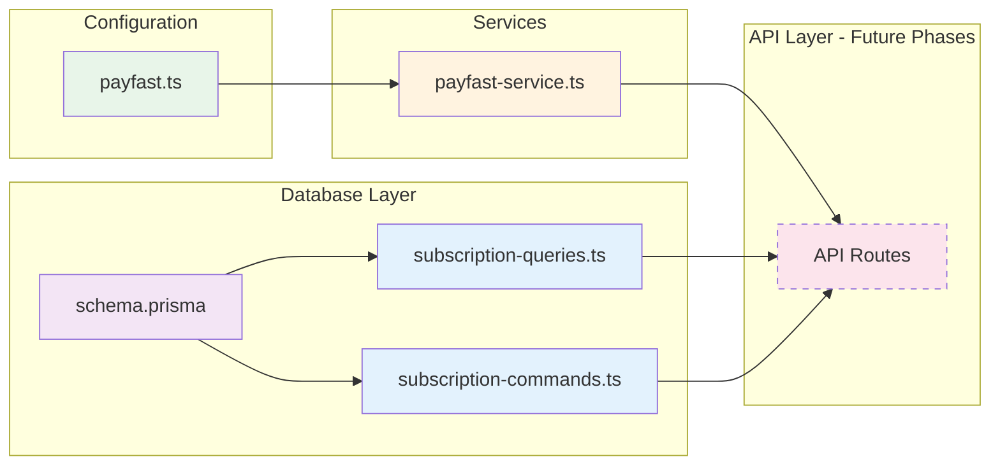
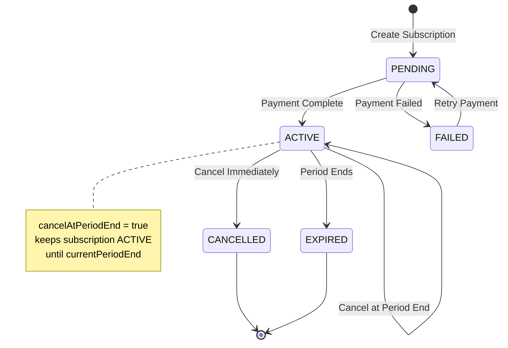
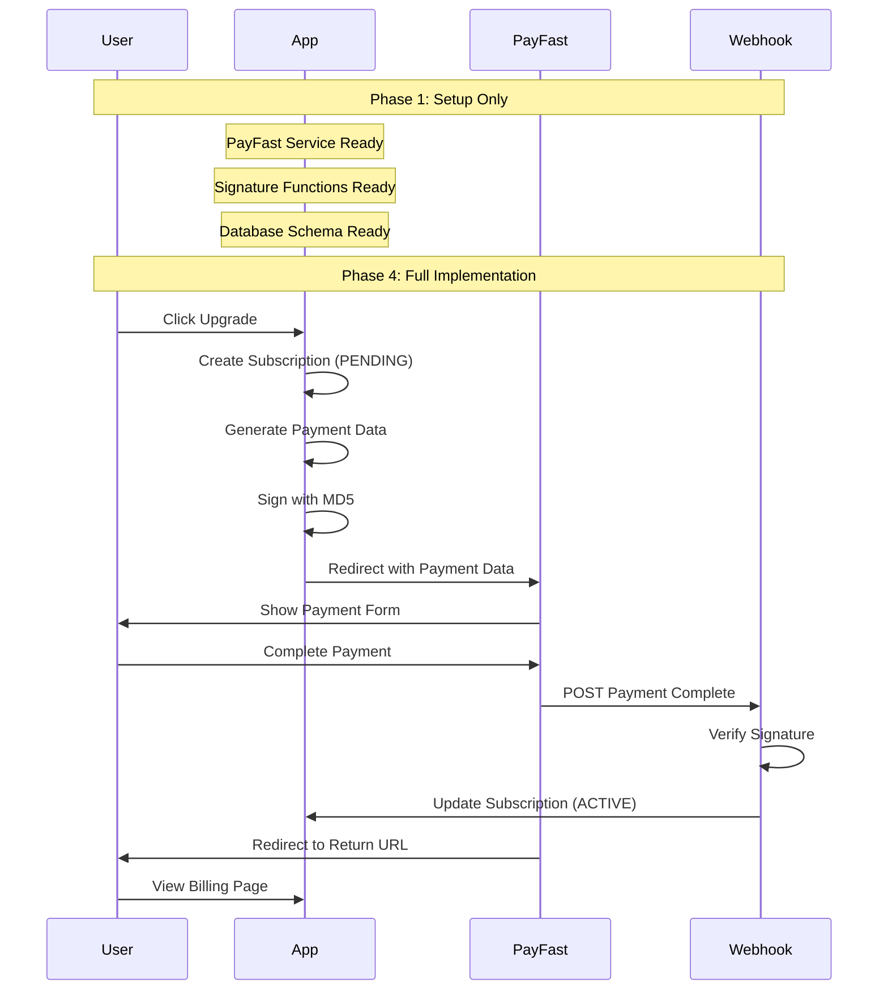

# Phase 1: Architecture Overview

## System Architecture



## Data Model



## Component Structure



## Subscription Status Flow



## PayFast Integration Flow (Future Phases)



## File Organization

```
src/
├── config/
│   └── payfast.ts                    # PayFast configuration & constants
│
├── services/
│   └── billing/
│       └── payfast-service.ts        # PayFast integration functions
│
├── prisma/
│   ├── schema.prisma                 # Database schema with Subscription models
│   ├── queries/
│   │   └── subscription-queries.ts   # Read operations
│   └── commands/
│       └── subscription-commands.ts  # Write operations
│
└── services/
    └── endpoints.ts                  # API endpoint constants (updated)
```

## Key Functions

### PayFast Service

| Function              | Purpose                          | Phase Used |
| --------------------- | -------------------------------- | ---------- |
| `generateSignature()` | Create MD5 signature for PayFast | 1, 4       |
| `verifySignature()`   | Verify webhook signatures        | 1, 4       |
| `createPaymentData()` | Generate payment form data       | 4          |
| `parseWebhookData()`  | Parse webhook POST data          | 4          |

### Subscription Queries

| Function                     | Purpose                               | Phase Used |
| ---------------------------- | ------------------------------------- | ---------- |
| `getSubscriptionByScope()`   | Get subscription for a team           | 2, 3, 4, 5 |
| `getSubscriptionByToken()`   | Find subscription by PayFast token    | 4          |
| `hasActiveSubscription()`    | Check if team has active subscription | 2, 4, 5    |
| `getExpiringSubscriptions()` | Find subscriptions expiring soon      | 7          |

### Subscription Commands

| Function                          | Purpose                    | Phase Used |
| --------------------------------- | -------------------------- | ---------- |
| `createSubscription()`            | Create new subscription    | 4          |
| `activateSubscription()`          | Activate after payment     | 4          |
| `updateSubscriptionStatus()`      | Change subscription status | 4, 5       |
| `cancelSubscription()`            | Cancel subscription        | 5          |
| `createSubscriptionTransaction()` | Record payment event       | 4          |
| `updateSubscriptionPeriod()`      | Update billing period      | 4          |

## Security Considerations

### Signature Verification

- All PayFast webhooks must be verified using MD5 signature
- Passphrase adds extra security layer
- Prevents tampering with payment data

### Environment Variables

- Merchant credentials stored in environment variables
- Passphrase never committed to repository
- Sandbox vs Production controlled by NODE_ENV

### Database Constraints

- Foreign key constraints ensure data integrity
- Unique constraints on scopeId prevent duplicate subscriptions
- Indexes optimize query performance

## Performance Optimizations

### Database Indexes

```sql
-- Subscription indexes
CREATE INDEX idx_subscription_scope_status ON "Subscription"(scopeId, status);
CREATE INDEX idx_subscription_status_period ON "Subscription"(status, currentPeriodEnd);

-- Transaction indexes
CREATE INDEX idx_transaction_subscription_created ON "SubscriptionTransaction"(subscriptionId, createdAt DESC);
```

### Query Patterns

- Use `findUnique` for single subscription lookups (indexed on scopeId)
- Include related data in single query to avoid N+1 problems
- Limit transaction history to recent records (take: 10)

## Testing Strategy

### Unit Tests (Future)

- Test signature generation with known inputs
- Test signature verification with valid/invalid signatures
- Test subscription status transitions
- Test date calculations for billing periods

### Integration Tests (Future)

- Test database operations (CRUD)
- Test PayFast webhook handling
- Test subscription lifecycle

### Manual Testing (Phase 1)

- Verify database migration
- Check table structure
- Test query/command functions in isolation
- Ensure no breaking changes to existing features

## Migration Strategy

### Database Migration

```bash
npm run migrate-dev
```

Creates:

1. New enums (SubscriptionStatus, TransactionType)
2. Subscription table with indexes
3. SubscriptionTransaction table with indexes
4. Foreign key relationships

### Rollback Plan

If issues arise:

```bash
# Rollback migration
npx prisma migrate resolve --rolled-back [migration_name]

# Or drop tables manually
DROP TABLE "SubscriptionTransaction";
DROP TABLE "Subscription";
DROP TYPE "TransactionType";
DROP TYPE "SubscriptionStatus";
```

## Configuration Values

### PayFast Sandbox

- Merchant ID: `10000100`
- Merchant Key: `46f0cd694581a`
- Test URL: `https://sandbox.payfast.co.za/eng/process`

### Subscription Settings

- Amount: R99.00
- Currency: ZAR
- Billing Cycle: Monthly
- Cycles: 0 (recurring until cancelled)

### URLs (to be configured)

- Return URL: `/settings/[scopeId]/billing?payment=success`
- Cancel URL: `/settings/[scopeId]/billing?payment=cancelled`
- Notify URL: `/api/v1/billing/webhook`

## Phase 1 Deliverables

✅ Database schema with Subscription models
✅ PayFast configuration file
✅ PayFast service with signature functions
✅ Subscription queries (read operations)
✅ Subscription commands (write operations)
✅ Environment variables setup
✅ Billing endpoints constants
✅ Database migration
✅ Documentation

## Success Criteria

- [ ] Migration runs without errors
- [ ] New tables visible in database
- [ ] All TypeScript files compile
- [ ] No breaking changes to existing features
- [ ] Can import and use all new functions
- [ ] Signature generation produces consistent results
- [ ] Database operations work correctly

## Next Phase Preview

**Phase 2: Premium Feature Gates**

- Add `require-subscription.ts` utility
- Create `PremiumFeatureGate` component
- Protect sentiments and health-checks APIs
- Show upgrade prompts to users

This will be the first user-visible change!
