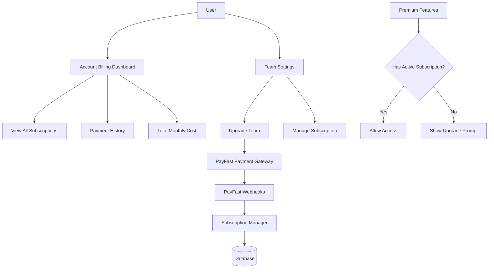

# Billing Feature Implementation Plan

## Overview

This document outlines the complete implementation plan for adding a subscription-based billing feature to enable premium features (daily sentiments and health checks) for teams at R99/month per team using PayFast integration.

**Architecture Notes:**

- Uses Next.js App Router with `route.ts` files
- API versioned as `/api/v1/*`
- Functional programming approach (no classes)
- TypeScript with pure functions

## Business Requirements

### Subscription Model

- **Price**: R99 per month per team
- **Billing Cycle**: Monthly recurring subscription via PayFast
- **Scope**: Each team requires its own subscription
- **Premium Features**:
  - Daily Sentiments
  - Health Checks
- **User Experience**: Features visible but locked with upgrade prompts for non-premium teams

### Billing Management

- **User Account Level**: View all subscriptions, total monthly cost, payment history
- **Team Settings Level**: Upgrade/downgrade specific team, view team subscription status

---

## Architecture Overview



---

## 1. Database Schema Design

### New Tables

#### Subscription

Tracks team subscription status and PayFast details.

```prisma
model Subscription {
  id                    Int                 @id @default(autoincrement())
  scopeId               Int                 @unique
  scope                 Scope               @relation(fields: [scopeId], references: [id], onDelete: Cascade)

  // PayFast Integration
  payfastToken          String              @unique
  payfastSubscriptionId String?             @unique

  // Subscription Details
  status                SubscriptionStatus  @default(PENDING)
  amount                Int                 // Amount in cents (9900 for R99)
  currency              String              @default("ZAR")

  // Billing Cycle
  currentPeriodStart    DateTime?
  currentPeriodEnd      DateTime?
  cancelAtPeriodEnd     Boolean             @default(false)

  // Metadata
  subscribedBy          String              // User who initiated subscription
  subscribedAt          DateTime?
  cancelledAt           DateTime?
  cancelledBy           String?

  createdAt             DateTime            @default(now())
  updatedAt             DateTime            @updatedAt

  // Relations
  transactions          SubscriptionTransaction[]

  @@index([scopeId, status])
  @@index([payfastToken])
  @@index([status])
}

enum SubscriptionStatus {
  PENDING       // Payment initiated but not confirmed
  ACTIVE        // Subscription active and paid
  PAST_DUE      // Payment failed, grace period
  CANCELLED     // User cancelled, active until period end
  EXPIRED       // Subscription ended
  SUSPENDED     // Admin suspended
}
```

#### SubscriptionTransaction

Tracks all payment transactions for audit and history.

```prisma
model SubscriptionTransaction {
  id                Int                       @id @default(autoincrement())
  subscriptionId    Int
  subscription      Subscription              @relation(fields: [subscriptionId], references: [id], onDelete: Cascade)

  // PayFast Details
  payfastPaymentId  String                    @unique
  merchantId        String
  merchantKey       String

  // Transaction Details
  amount            Int                       // Amount in cents
  status            SubscriptionTransactionStatus
  type              SubscriptionTransactionType

  // Metadata
  metadata          Json?                     // Store full PayFast response
  processedAt       DateTime?

  createdAt         DateTime                  @default(now())
  updatedAt         DateTime                  @updatedAt

  @@index([subscriptionId, createdAt(sort: Desc)])
  @@index([payfastPaymentId])
}

enum SubscriptionTransactionStatus {
  PENDING
  COMPLETED
  FAILED
  REFUNDED
}

enum SubscriptionTransactionType {
  INITIAL_PAYMENT
  RECURRING_PAYMENT
  CANCELLATION_REFUND
  FAILED_PAYMENT
}
```

### Schema Updates

Update existing Scope model:

```prisma
model Scope {
  // ... existing fields
  subscription      Subscription?
}
```

---

## 2. PayFast Integration Infrastructure

### Configuration

Create `src/config/payfast.ts`:

```typescript
export const PAYFAST_CONFIG = {
  merchantId: process.env.PAYFAST_MERCHANT_ID!,
  merchantKey: process.env.PAYFAST_MERCHANT_KEY!,
  passphrase: process.env.PAYFAST_PASSPHRASE!,
  baseUrl:
    process.env.NODE_ENV === "production"
      ? "https://www.payfast.co.za/eng/process"
      : "https://sandbox.payfast.co.za/eng/process",
  subscriptionAmount: 9900, // R99 in cents
  currency: "ZAR",
  returnUrl: `${process.env.NEXT_PUBLIC_APP_URL}/billing/success`,
  cancelUrl: `${process.env.NEXT_PUBLIC_APP_URL}/billing/cancelled`,
  notifyUrl: `${process.env.NEXT_PUBLIC_APP_URL}/api/v1/billing/webhook`,
} as const;

export const SUBSCRIPTION_FEATURES = {
  DAILY_SENTIMENTS: "daily_sentiments",
  HEALTH_CHECKS: "health_checks",
} as const;
```

### PayFast Service (Functional)

Create `src/services/billing/payfast-service.ts`:

```typescript
import crypto from "crypto";
import { PAYFAST_CONFIG } from "@/config/payfast";

/**
 * Generate PayFast payment signature
 */
export function generatePayFastSignature(data: Record<string, string>): string {
  const pfParamString = Object.keys(data)
    .sort()
    .map(
      (key) => `${key}=${encodeURIComponent(data[key]).replace(/%20/g, "+")}`
    )
    .join("&");

  return crypto.createHash("md5").update(pfParamString).digest("hex");
}

/**
 * Verify PayFast webhook signature
 */
export function verifyPayFastSignature(
  data: Record<string, string>,
  signature: string
): boolean {
  const calculatedSignature = generatePayFastSignature(data);
  return calculatedSignature === signature;
}

/**
 * Create subscription payment data
 */
export function createSubscriptionPaymentData(params: {
  scopeId: number;
  scopeName: string;
  userEmail: string;
  token: string;
}) {
  const data = {
    merchant_id: PAYFAST_CONFIG.merchantId,
    merchant_key: PAYFAST_CONFIG.merchantKey,
    return_url: PAYFAST_CONFIG.returnUrl,
    cancel_url: PAYFAST_CONFIG.cancelUrl,
    notify_url: PAYFAST_CONFIG.notifyUrl,

    // Subscription details
    subscription_type: "1", // Subscription
    billing_date: new Date().toISOString().split("T")[0],
    recurring_amount: (PAYFAST_CONFIG.subscriptionAmount / 100).toFixed(2),
    frequency: "3", // Monthly
    cycles: "0", // Indefinite

    // Item details
    item_name: `${params.scopeName} Premium Subscription`,
    item_description: "Monthly subscription for premium features",
    amount: (PAYFAST_CONFIG.subscriptionAmount / 100).toFixed(2),

    // Custom fields
    custom_str1: params.scopeId.toString(),
    custom_str2: params.token,

    // User details
    email_address: params.userEmail,
  };

  const signature = generatePayFastSignature(data);

  return {
    ...data,
    signature,
  };
}

/**
 * Validate webhook IP (PayFast only sends from specific IPs)
 */
export function isValidPayFastIP(ip: string): boolean {
  const validIPs = [
    "197.97.145.144",
    "197.97.145.145",
    "197.97.145.146",
    "197.97.145.147",
    "197.97.145.148",
  ];
  return validIPs.includes(ip);
}

/**
 * Build PayFast payment URL with data
 */
export function buildPayFastUrl(paymentData: Record<string, string>): string {
  const params = new URLSearchParams(paymentData);
  return `${PAYFAST_CONFIG.baseUrl}?${params.toString()}`;
}
```

---

## 3. Subscription Management API Endpoints (Next.js App Router)

### API Structure

Update `src/services/endpoints.ts`:

```typescript
export const ENDPOINTS = {
  // ... existing endpoints
  billing: {
    base: "/api/v1/billing",
    subscriptions: "/api/v1/billing/subscriptions",
    webhook: "/api/v1/billing/webhook",
    transactions: "/api/v1/billing/transactions",
  },
};
```

### Get All User Subscriptions

Create `src/app/api/v1/billing/subscriptions/route.ts`:

```typescript
import { NextRequest, NextResponse } from "next/server";
import { getSupabaseClient } from "@/utils/get-supabase-client";
import { getUserSubscriptions } from "@/prisma/queries/subscription-queries";

export async function GET(request: NextRequest) {
  try {
    const supabase = getSupabaseClient(request);
    const {
      data: { session },
    } = await supabase.auth.getSession();

    if (!session) {
      return NextResponse.json({ error: "not_authenticated" }, { status: 401 });
    }

    const subscriptions = await getUserSubscriptions(session.user.id);

    return NextResponse.json({ subscriptions });
  } catch (error) {
    console.error("Error fetching subscriptions:", error);
    return NextResponse.json(
      { error: "internal_server_error" },
      { status: 500 }
    );
  }
}
```

### Get Team Subscription

Create `src/app/api/v1/billing/subscriptions/[scopeId]/route.ts`:

```typescript
import { NextRequest, NextResponse } from "next/server";
import { getSupabaseClient } from "@/utils/get-supabase-client";
import { getScopeSubscription } from "@/prisma/queries/subscription-queries";
import { userHasEditPermission } from "@/prisma/queries/permission-queries";

export async function GET(
  request: NextRequest,
  { params }: { params: { scopeId: string } }
) {
  try {
    const supabase = getSupabaseClient(request);
    const {
      data: { session },
    } = await supabase.auth.getSession();

    if (!session) {
      return NextResponse.json({ error: "not_authenticated" }, { status: 401 });
    }

    const scopeId = parseInt(params.scopeId);

    // Check user has edit permission for scope
    const hasPermission = await userHasEditPermission(session.user.id, scopeId);
    if (!hasPermission) {
      return NextResponse.json({ error: "forbidden" }, { status: 403 });
    }

    const subscription = await getScopeSubscription(scopeId);

    return NextResponse.json({ subscription });
  } catch (error) {
    console.error("Error fetching subscription:", error);
    return NextResponse.json(
      { error: "internal_server_error" },
      { status: 500 }
    );
  }
}
```

### Create Subscription

Create `src/app/api/v1/billing/subscriptions/[scopeId]/create/route.ts`:

```typescript
import { NextRequest, NextResponse } from "next/server";
import { getSupabaseClient } from "@/utils/get-supabase-client";
import { userHasEditPermission } from "@/prisma/queries/permission-queries";
import { createSubscription } from "@/prisma/commands/subscription-commands";
import { getScopeById } from "@/prisma/queries/scope-queries";
import {
  createSubscriptionPaymentData,
  buildPayFastUrl,
} from "@/services/billing/payfast-service";
import { randomBytes } from "crypto";
import { trackSubscriptionInitiated } from "@/services/analytics/billing-events";

export async function POST(
  request: NextRequest,
  { params }: { params: { scopeId: string } }
) {
  try {
    const supabase = getSupabaseClient(request);
    const {
      data: { session },
    } = await supabase.auth.getSession();

    if (!session) {
      return NextResponse.json({ error: "not_authenticated" }, { status: 401 });
    }

    const scopeId = parseInt(params.scopeId);

    // Check user has edit permission for scope
    const hasPermission = await userHasEditPermission(session.user.id, scopeId);
    if (!hasPermission) {
      return NextResponse.json({ error: "forbidden" }, { status: 403 });
    }

    // Get scope details
    const scope = await getScopeById(scopeId);
    if (!scope) {
      return NextResponse.json({ error: "scope_not_found" }, { status: 404 });
    }

    // Generate unique token
    const token = randomBytes(32).toString("hex");

    // Create subscription record
    const subscription = await createSubscription({
      scopeId,
      subscribedBy: session.user.id,
      payfastToken: token,
    });

    // Create PayFast payment data
    const paymentData = createSubscriptionPaymentData({
      scopeId,
      scopeName: scope.name,
      userEmail: session.user.email!,
      token,
    });

    // Build PayFast URL
    const paymentUrl = buildPayFastUrl(paymentData);

    // Track analytics
    trackSubscriptionInitiated({
      scopeId,
      scopeName: scope.name,
      amount: 9900,
    });

    return NextResponse.json({
      subscription,
      paymentUrl,
      paymentData,
    });
  } catch (error) {
    console.error("Error creating subscription:", error);
    return NextResponse.json(
      { error: "internal_server_error" },
      { status: 500 }
    );
  }
}
```

### Cancel Subscription

Create `src/app/api/v1/billing/subscriptions/[scopeId]/cancel/route.ts`:

```typescript
import { NextRequest, NextResponse } from "next/server";
import { getSupabaseClient } from "@/utils/get-supabase-client";
import { userHasEditPermission } from "@/prisma/queries/permission-queries";
import { cancelSubscription } from "@/prisma/commands/subscription-commands";
import { getScopeSubscription } from "@/prisma/queries/subscription-queries";
import { trackSubscriptionCancelled } from "@/services/analytics/billing-events";
import { sendSubscriptionCancelledNotification } from "@/backend/notifications/services/send-subscription-notification";

export async function POST(
  request: NextRequest,
  { params }: { params: { scopeId: string } }
) {
  try {
    const supabase = getSupabaseClient(request);
    const {
      data: { session },
    } = await supabase.auth.getSession();

    if (!session) {
      return NextResponse.json({ error: "not_authenticated" }, { status: 401 });
    }

    const scopeId = parseInt(params.scopeId);

    // Check user has edit permission for scope
    const hasPermission = await userHasEditPermission(session.user.id, scopeId);
    if (!hasPermission) {
      return NextResponse.json({ error: "forbidden" }, { status: 403 });
    }

    // Get current subscription
    const currentSubscription = await getScopeSubscription(scopeId);
    if (!currentSubscription) {
      return NextResponse.json(
        { error: "subscription_not_found" },
        { status: 404 }
      );
    }

    // Cancel subscription (at period end)
    const subscription = await cancelSubscription({
      scopeId,
      cancelledBy: session.user.id,
      immediate: false,
    });

    // Track analytics
    trackSubscriptionCancelled({
      scopeId,
      subscriptionId: subscription.id,
    });

    // Send notification
    if (subscription.currentPeriodEnd) {
      await sendSubscriptionCancelledNotification({
        userId: session.user.id,
        scopeId,
        endDate: subscription.currentPeriodEnd,
      });
    }

    return NextResponse.json({ subscription });
  } catch (error) {
    console.error("Error cancelling subscription:", error);
    return NextResponse.json(
      { error: "internal_server_error" },
      { status: 500 }
    );
  }
}
```

### Get Transactions

Create `src/app/api/v1/billing/transactions/route.ts`:

```typescript
import { NextRequest, NextResponse } from "next/server";
import { getSupabaseClient } from "@/utils/get-supabase-client";
import { getUserTransactions } from "@/prisma/queries/subscription-queries";

export async function GET(request: NextRequest) {
  try {
    const supabase = getSupabaseClient(request);
    const {
      data: { session },
    } = await supabase.auth.getSession();

    if (!session) {
      return NextResponse.json({ error: "not_authenticated" }, { status: 401 });
    }

    const transactions = await getUserTransactions(session.user.id);

    return NextResponse.json({ transactions });
  } catch (error) {
    console.error("Error fetching transactions:", error);
    return NextResponse.json(
      { error: "internal_server_error" },
      { status: 500 }
    );
  }
}
```

### Webhook Handler

Create `src/app/api/v1/billing/webhook/route.ts`:

```typescript
import { NextRequest, NextResponse } from "next/server";
import {
  verifyPayFastSignature,
  isValidPayFastIP,
} from "@/services/billing/payfast-service";
import { processWebhook } from "@/services/billing/subscription-manager";

export async function POST(request: NextRequest) {
  try {
    // Verify IP
    const ip =
      request.headers.get("x-forwarded-for") ||
      request.headers.get("x-real-ip") ||
      "unknown";

    if (!isValidPayFastIP(ip)) {
      return NextResponse.json({ error: "invalid_ip" }, { status: 403 });
    }

    // Parse body
    const body = await request.json();
    const { signature, ...data } = body;

    // Verify signature
    if (!verifyPayFastSignature(data, signature)) {
      return NextResponse.json({ error: "invalid_signature" }, { status: 400 });
    }

    // Process webhook based on payment_status
    const { payment_status, custom_str1, custom_str2 } = data;
    const scopeId = parseInt(custom_str1);
    const token = custom_str2;

    await processWebhook({
      scopeId,
      token,
      status: payment_status,
      data,
    });

    return NextResponse.json({ success: true });
  } catch (error) {
    console.error("Webhook processing error:", error);
    return NextResponse.json(
      { error: "webhook_processing_failed" },
      { status: 500 }
    );
  }
}
```

---

## 4. Premium Feature Protection

### Subscription Checker Utility

Create `src/utils/require-subscription.ts`:

```typescript
import { NextRequest, NextResponse } from "next/server";
import { hasActiveSubscription } from "@/prisma/queries/subscription-queries";

/**
 * Middleware to check if scope has active subscription
 */
export async function requireSubscription(
  scopeId: number
): Promise<{ hasSubscription: boolean; response?: NextResponse }> {
  if (!scopeId) {
    return {
      hasSubscription: false,
      response: NextResponse.json(
        {
          error: "missing_scope_id",
          description: "Scope ID is required",
        },
        { status: 400 }
      ),
    };
  }

  const hasSubscription = await hasActiveSubscription(scopeId);

  if (!hasSubscription) {
    return {
      hasSubscription: false,
      response: NextResponse.json(
        {
          error: "subscription_required",
          description: "This feature requires an active subscription",
          scopeId,
        },
        { status: 402 }
      ),
    };
  }

  return { hasSubscription: true };
}
```

### Update Protected Endpoints

Update `src/app/api/sentiments/route.ts`:

```typescript
import { NextRequest, NextResponse } from "next/server";
import { requireSubscription } from "@/utils/require-subscription";
import { getSupabaseClient } from "@/utils/get-supabase-client";

export async function POST(request: NextRequest) {
  try {
    const supabase = getSupabaseClient(request);
    const {
      data: { session },
    } = await supabase.auth.getSession();

    if (!session) {
      return NextResponse.json({ error: "not_authenticated" }, { status: 401 });
    }

    const body = await request.json();
    const { scopeId } = body;

    // Check subscription
    const { hasSubscription, response } = await requireSubscription(scopeId);
    if (!hasSubscription && response) {
      return response;
    }

    // Create sentiment...
    // ... rest of implementation
  } catch (error) {
    console.error("Error creating sentiment:", error);
    return NextResponse.json(
      { error: "internal_server_error" },
      { status: 500 }
    );
  }
}
```

Update `src/app/api/health-checks/route.ts`:

```typescript
import { NextRequest, NextResponse } from "next/server";
import { requireSubscription } from "@/utils/require-subscription";
import { getSupabaseClient } from "@/utils/get-supabase-client";

export async function POST(request: NextRequest) {
  try {
    const supabase = getSupabaseClient(request);
    const {
      data: { session },
    } = await supabase.auth.getSession();

    if (!session) {
      return NextResponse.json({ error: "not_authenticated" }, { status: 401 });
    }

    const body = await request.json();
    const { scopeId } = body;

    // Check subscription
    const { hasSubscription, response } = await requireSubscription(scopeId);
    if (!hasSubscription && response) {
      return response;
    }

    // Create health check...
    // ... rest of implementation
  } catch (error) {
    console.error("Error creating health check:", error);
    return NextResponse.json(
      { error: "internal_server_error" },
      { status: 500 }
    );
  }
}
```

---

## 5. Database Queries and Commands

### Subscription Queries

Create `src/prisma/queries/subscription-queries.ts`:

```typescript
import { prisma } from "@/prisma";
import { SubscriptionStatus } from "@prisma/client";

export async function hasActiveSubscription(scopeId: number): Promise<boolean> {
  const subscription = await prisma.subscription.findUnique({
    where: { scopeId },
    select: { status: true, currentPeriodEnd: true },
  });

  if (!subscription) return false;

  return (
    subscription.status === SubscriptionStatus.ACTIVE &&
    subscription.currentPeriodEnd &&
    subscription.currentPeriodEnd > new Date()
  );
}

export async function getUserSubscriptions(userId: string) {
  return prisma.subscription.findMany({
    where: {
      scope: {
        roles: {
          some: {
            userId,
            role: "ADMIN",
          },
        },
      },
    },
    include: {
      scope: {
        select: {
          id: true,
          name: true,
          image: true,
          type: true,
        },
      },
    },
    orderBy: { createdAt: "desc" },
  });
}

export async function getScopeSubscription(scopeId: number) {
  return prisma.subscription.findUnique({
    where: { scopeId },
    include: {
      transactions: {
        orderBy: { createdAt: "desc" },
        take: 10,
      },
    },
  });
}

export async function getUserTransactions(userId: string) {
  return prisma.subscriptionTransaction.findMany({
    where: {
      subscription: {
        scope: {
          roles: {
            some: {
              userId,
              role: "ADMIN",
            },
          },
        },
      },
    },
    include: {
      subscription: {
        include: {
          scope: {
            select: {
              id: true,
              name: true,
            },
          },
        },
      },
    },
    orderBy: { createdAt: "desc" },
    take: 50,
  });
}
```

### Subscription Commands

Create `src/prisma/commands/subscription-commands.ts`:

```typescript
import { prisma } from "@/prisma";
import {
  SubscriptionStatus,
  SubscriptionTransactionStatus,
  SubscriptionTransactionType,
} from "@prisma/client";

export async function createSubscription(params: {
  scopeId: number;
  subscribedBy: string;
  payfastToken: string;
}) {
  return prisma.subscription.create({
    data: {
      scopeId: params.scopeId,
      subscribedBy: params.subscribedBy,
      payfastToken: params.payfastToken,
      status: SubscriptionStatus.PENDING,
      amount: 9900, // R99 in cents
      currency: "ZAR",
    },
  });
}

export async function activateSubscription(params: {
  payfastToken: string;
  payfastSubscriptionId: string;
  currentPeriodStart: Date;
  currentPeriodEnd: Date;
}) {
  return prisma.subscription.update({
    where: { payfastToken: params.payfastToken },
    data: {
      status: SubscriptionStatus.ACTIVE,
      payfastSubscriptionId: params.payfastSubscriptionId,
      currentPeriodStart: params.currentPeriodStart,
      currentPeriodEnd: params.currentPeriodEnd,
      subscribedAt: new Date(),
    },
  });
}

export async function cancelSubscription(params: {
  scopeId: number;
  cancelledBy: string;
  immediate?: boolean;
}) {
  const data = params.immediate
    ? {
        status: SubscriptionStatus.CANCELLED,
        cancelledAt: new Date(),
        cancelledBy: params.cancelledBy,
      }
    : {
        cancelAtPeriodEnd: true,
        cancelledBy: params.cancelledBy,
      };

  return prisma.subscription.update({
    where: { scopeId: params.scopeId },
    data,
  });
}

export async function createTransaction(params: {
  subscriptionId: number;
  payfastPaymentId: string;
  merchantId: string;
  merchantKey: string;
  amount: number;
  status: SubscriptionTransactionStatus;
  type: SubscriptionTransactionType;
  metadata?: any;
}) {
  return prisma.subscriptionTransaction.create({
    data: params,
  });
}

export async function expireSubscriptions() {
  const now = new Date();

  return prisma.subscription.updateMany({
    where: {
      status: SubscriptionStatus.ACTIVE,
      currentPeriodEnd: {
        lt: now,
      },
    },
    data: {
      status: SubscriptionStatus.EXPIRED,
    },
  });
}
```

---

## 6. Subscription Manager Service (Functional)

Create `src/services/billing/subscription-manager.ts`:

```typescript
import {
  activateSubscription,
  cancelSubscription,
  createTransaction,
} from '@/prisma/commands/subscription-commands';
import { SubscriptionTransactionStatus, SubscriptionTransactionType } from '@prisma/client';
import { prisma } from '@/prisma';
import {
  sendSubscriptionActivatedNotification,
  sendPaymentFailedNotification
} from '@/backend/notifications/services/send-subscription-notification';
import {
  trackSubscriptionActivated,
  trackPaymentCompleted,
  trackPaymentFailed,
} from '@/services/analytics/billing-events';

interface WebhookParams {
  scopeId: number;
  token: string;
  status: string;
  data: any;
}

/**
 * Process PayFast webhook
 */
export async function processWebhook(params: WebhookParams) {
  const { scopeId, token, status, data } = params;

  switch (status) {
    case 'COMPLETE':
      await handlePaymentComplete(scopeId, token, data);
      break;
    case 'FAILED':
      await handlePaymentFailed(scopeId, token, data);
      break;
    case 'CANCELLED':
      await handleSubscriptionCancelled(scopeId, token, data);
      break;
    default:
      console.log('Unhandled payment status:', status);
  }
}

async function handlePaymentComplete(
  scopeId: number,
  token: string,
  data: any
) {
  // Calculate period dates
  const currentPeriodStart = new Date();
  const currentPeriodEnd = new Date();
  currentPeriodEnd.setMonth(currentPeriodEnd.getMonth() + 1);

  // Activate subscription
  const subscription = await activateSubscription({
    payfastToken: token,
    payfastSubscriptionId: data.token,
    currentPeriodStart,
    currentPeriodEnd,
  });

  // Record transaction
  await createTransaction({
    subscriptionId: subscription.id,
    payfastPaymentId: data.pf_payment_id,
    merchantId: data.merchant_id,
    merchantKey: data.merchant_key,
    amount: parseInt(data.amount_
```
